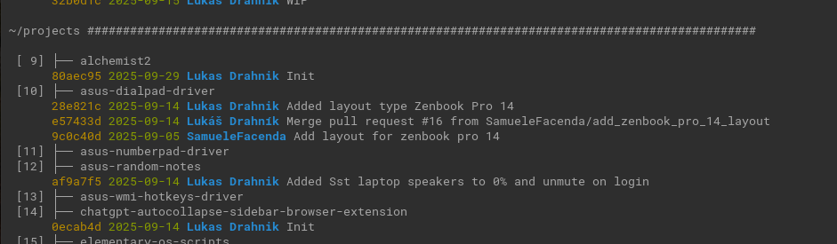

# Alchemist 2

[](https://www.gnu.org/licenses/old-licenses/gpl-2.0.en.html)


Entry point for your projects managed by git.



## Features

Anywhere in terminal:

- Open new terminal tab for choosed project and jump there (by pressing the number of project)
- Show uncommitted changes
- Show committing users info
- Show every origin
- Show commited changes for past time interval (1d is default)

## Usage

```
## Are repos correctly set up? Is something not commited? 
$ gitstatus --urls --names

## What was commited for past 3 days?
$ gitstatus --logs 3d

## Set name and mail for projects in work
$ gitconfig ~/ccp-projects --name "Lukas Drahnik" --mail "lukas.drahnik@img.cas.cz"
```

## Installation

Add to `~/.bashrc`:

```
# alchemist2 (aliases)
alias gitstatus='bash ~/projects/alchemist2/gitstatus.sh'
alias gitconfig='bash ~/projects/alchemist2/gitconfig.sh'

# alchemist2 (aliases of aliases)
alias gitusers='bash ~/projects/alchemist2/gitstatus.sh --users'
alias giturls='bash ~/projects/alchemist2/gitstatus.sh --urls'
alias gitlogs='bash ~/projects/alchemist2/gitstatus.sh --logs'
```

And change in the script `gitstatus.sh[3]` because Elementary OS 7.1 terminal is default:

```
TERMINAL_CMD="io.elementary.terminal --new-tab --working-directory"
```